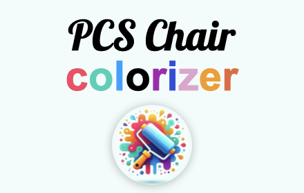
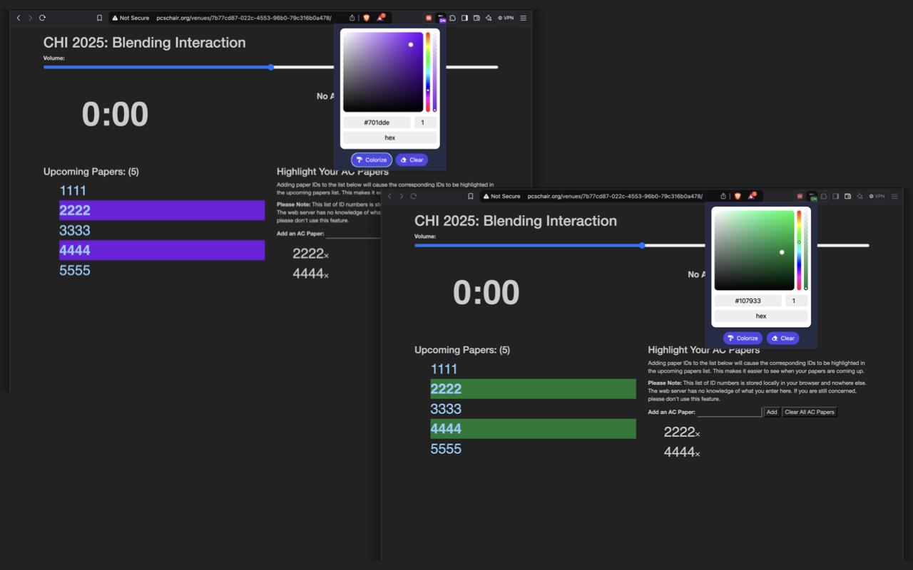

# PCS Chair Colorizer

This add-on enables you to choose an alternative color to emphasize the documents you are managing as an Associate Chair on the PCS Chair ([pcschair.org](https://pcschair.org)) platform. By using a color picker, you can tailor the color to suit your tastes, which is particularly useful for improving accessibility to the list. This extension is not an official tool but rather a contribution from the community.

<p align="center">
  
</p>

These are a few screenshots:



## License and Credits

MIT

Extension created by [MAKinteract](https://make.kaist.ac.kr)

## For developers

You need to have NodeJS install.
To build run

```sh
npm run build
```

and to package the extension

```sh
npm run package
```

and you will see a `extension.zip` file.
